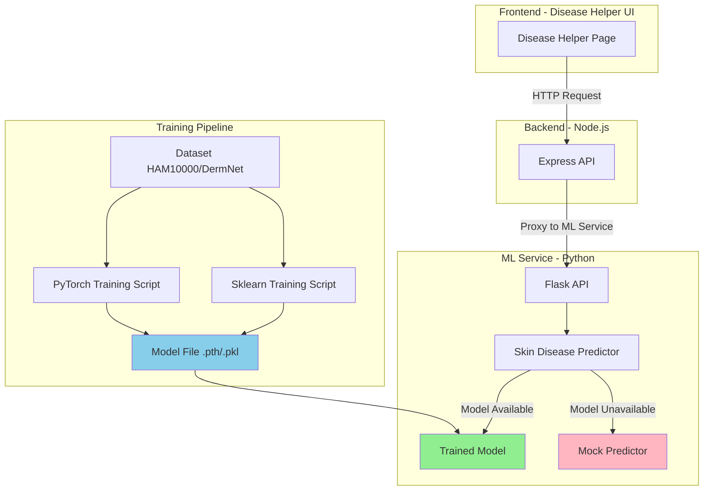
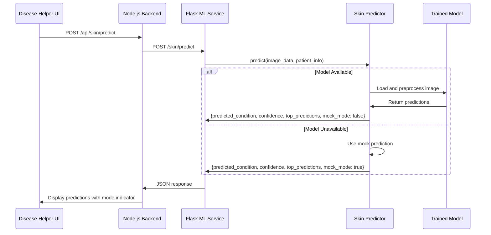

# Design Document: ML Model Accuracy Improvement

## Overview

This design document outlines the architecture and implementation approach for replacing the current mock skin disease prediction system with a real machine learning model. The system will support two training approaches: PyTorch (targeting 85-95% accuracy) and Scikit-learn (targeting 70-80% accuracy), both compatible with Python 3.14.

The design maintains backward compatibility with existing API endpoints and UI integration while providing a seamless transition from mock mode to real model predictions. The system includes robust error handling to gracefully fall back to mock mode if the real model is unavailable.

### Key Design Goals

1. **High Accuracy**: Achieve 85-95% accuracy with PyTorch or 70-80% with Scikit-learn
2. **Python 3.14 Compatibility**: Use frameworks that work with the current Python version
3. **Backward Compatibility**: Maintain existing API structure and UI integration
4. **Graceful Degradation**: Fall back to mock mode if real model unavailable
5. **Fast Inference**: Return predictions within 3 seconds
6. **Monitoring**: Track model performance and prediction metrics

## Architecture

### High-Level Architecture



### Component Interaction Flow



## Components and Interfaces

### 1. Training Scripts

#### PyTorch Training Script (`train_skin_disease_pytorch.py`)

**Purpose**: Train a deep learning model using transfer learning with MobileNetV2

**Key Classes**:
- `SkinDiseaseDataset`: Custom PyTorch dataset for loading skin disease images
- `SkinDiseaseModel`: Neural network model with pre-trained backbone and custom classifier
- `SkinDiseaseTrainer`: Handles training loop, validation, and model saving

**Interface**:
```python
class SkinDiseaseTrainer:
    def __init__(self, num_classes=22, device='cuda'):
        """Initialize trainer with number of classes and device"""
        
    def train_model(self, train_dir, val_dir=None, epochs=50, batch_size=32, lr=0.001):
        """
        Train the model
        
        Args:
            train_dir: Path to training data directory
            val_dir: Optional path to validation data directory
            epochs: Number of training epochs
            batch_size: Batch size for training
            lr: Learning rate
            
        Returns:
            model: Trained model
            history: Training history dict
            best_acc: Best validation accuracy achieved
        """
        
    def save_metadata(self, history, best_acc):
        """Save training metadata to JSON file"""
```

**Training Configuration**:
- Base Model: MobileNetV2 from timm library (pre-trained on ImageNet)
- Input Size: 224x224 RGB (resized from 256x256 with random crop)
- Batch Size: 32
- Epochs: 50
- Learning Rate: 0.001 with ReduceLROnPlateau scheduler
- Optimizer: Adam with weight decay 1e-4
- Loss: CrossEntropyLoss

**Data Augmentation**:
- Random crop from 256x256 to 224x224
- Random horizontal flip
- Random vertical flip
- Random rotation (±30 degrees)
- Color jitter (brightness, contrast, saturation ±0.2)
- Normalization with ImageNet statistics

**Model Architecture**:
```
Input (224x224x3)
    ↓
MobileNetV2 Backbone (pre-trained)
    ↓
Global Average Pooling
    ↓
Dropout(0.3) → Linear(512) → BatchNorm → ReLU
    ↓
Dropout(0.4) → Linear(256) → BatchNorm → ReLU
    ↓
Dropout(0.3) → Linear(22) → Softmax
    ↓
Output (22 classes)
```

#### Scikit-learn Training Script (`train_skin_sklearn.py`)

**Purpose**: Train a feature-based classifier using traditional ML algorithms

**Key Classes**:
- `ImageFeatureExtractor`: Extracts color, texture, and shape features from images
- `SkinDiseaseSklearnTrainer`: Trains ensemble of classifiers

**Interface**:
```python
class ImageFeatureExtractor:
    def extract_all_features(self, image_path):
        """
        Extract comprehensive features from image
        
        Returns:
            numpy array of features (color + texture + shape)
        """
        
class SkinDiseaseSklearnTrainer:
    def load_dataset(self, data_dir):
        """Load dataset and extract features from all images"""
        
    def train_models(self, X, y):
        """
        Train multiple models and create ensemble
        
        Returns:
            results: Dict of model performance metrics
            X_test: Test features
            y_test: Test labels
        """
        
    def save_models(self, results):
        """Save trained models, scaler, and metadata"""
```

**Feature Extraction**:
1. **Color Features** (27 features):
   - RGB statistics: mean, std, median, 25th/75th percentile per channel
   - HSV statistics: mean, std per channel
   - LAB statistics: mean, std per channel

2. **Texture Features** (8 features):
   - Edge detection (Canny): mean, std
   - Gradient features (Sobel): mean, std for x and y directions
   - Laplacian: mean, std

3. **Shape Features** (5 features):
   - Normalized area
   - Normalized perimeter
   - Circularity
   - Aspect ratio
   - Extent

**Total Features**: 40 features per image

**Models Trained**:
- Random Forest (200 trees, max_depth=20)
- Gradient Boosting (200 estimators, learning_rate=0.1)
- SVM (RBF kernel, C=10, with probability estimates)
- Ensemble: Soft voting classifier combining all three

### 2. Skin Disease Predictor (`skin_disease_predictor.py`)

**Purpose**: Load trained model and provide prediction interface

**Key Class**:
```python
class SkinDiseasePredictor:
    def __init__(self):
        """Initialize predictor and load model"""
        self.model = None
        self.class_names = [...]  # 22 skin conditions
        self.load_model()
        
    def load_model(self):
        """
        Load trained model from models/ directory
        Falls back to mock mode if model unavailable
        """
        
    def preprocess_image(self, image_data):
        """
        Preprocess image for prediction
        
        Args:
            image_data: Base64 string, file path, or PIL Image
            
        Returns:
            Preprocessed numpy array (1, 256, 256, 3) or (1, 40) for sklearn
        """
        
    def predict(self, image_data, patient_info=None):
        """
        Predict skin disease from image
        
        Args:
            image_data: Image in base64, file path, or PIL format
            patient_info: Optional patient metadata dict
            
        Returns:
            {
                'predicted_condition': str,
                'confidence': float,
                'confidence_level': 'High'|'Medium'|'Low',
                'top_predictions': [
                    {'condition': str, 'probability': float, 'confidence_percentage': float},
                    ...
                ],
                'patient_info': dict,
                'model_info': {
                    'type': str,
                    'classes': int,
                    'input_size': str
                },
                'available': bool,
                'mock_mode': bool,
                'disclaimer': str
            }
        """
        
    def predict_mock(self, patient_info=None):
        """
        Generate mock prediction with varied results
        Uses hash of patient_info for consistent but varied predictions
        """
        
    def get_supported_conditions(self):
        """Return list of all 22 supported skin conditions"""
        
    def is_available(self):
        """Check if predictor is available (real or mock)"""
```

**Model Loading Logic**:
```python
def load_model(self):
    # Try PyTorch model first
    if os.path.exists('models/skin_disease_pytorch_best.pth'):
        import torch
        checkpoint = torch.load('models/skin_disease_pytorch_best.pth')
        self.model = SkinDiseaseModel(num_classes=22)
        self.model.load_state_dict(checkpoint['model_state_dict'])
        self.model.eval()
        self.model_type = 'pytorch'
        return
    
    # Try Scikit-learn model
    if os.path.exists('models/skin_sklearn_models.pkl'):
        import pickle
        with open('models/skin_sklearn_models.pkl', 'rb') as f:
            self.models = pickle.load(f)
        with open('models/skin_sklearn_scaler.pkl', 'rb') as f:
            self.scaler = pickle.load(f)
        with open('models/skin_feature_extractor.pkl', 'rb') as f:
            self.feature_extractor = pickle.load(f)
        self.model = self.models['ensemble']
        self.model_type = 'sklearn'
        return
    
    # Fall back to mock mode
    self.model = "mock"
    self.model_type = 'mock'
```

**Image Preprocessing**:
```python
def preprocess_image(self, image_data):
    # Decode base64 if needed
    if isinstance(image_data, str):
        if image_data.startswith('data:image'):
            image_data = image_data.split(',')[1]
        image_bytes = base64.b64decode(image_data)
        image = Image.open(io.BytesIO(image_bytes))
    
    # Convert to RGB
    if image.mode != 'RGB':
        image = image.convert('RGB')
    
    # Resize to 256x256
    image = image.resize((256, 256))
    
    if self.model_type == 'pytorch':
        # PyTorch preprocessing
        image_array = np.array(image) / 255.0
        image_array = np.expand_dims(image_array, axis=0)
        return torch.from_numpy(image_array).permute(0, 3, 1, 2).float()
    
    elif self.model_type == 'sklearn':
        # Sklearn preprocessing - extract features
        return self.feature_extractor.extract_all_features(image)
    
    return None
```

### 3. Flask API (`app.py`)

**Endpoints**:

**GET /skin/conditions**
```python
Response:
{
    'conditions': [list of 22 condition names],
    'total_count': 22,
    'model_available': bool,
    'mock_mode': bool
}
```

**POST /skin/predict**
```python
Request:
{
    'image': 'base64_encoded_image_data',
    'patient_info': {
        'name': str,
        'age': int,
        'gender': str,
        ...
    }
}

Response:
{
    'patient_info': {...},
    'prediction': {
        'predicted_condition': str,
        'confidence': float,
        'confidence_level': str,
        'top_predictions': [...],
        'model_info': {...},
        'available': bool,
        'mock_mode': bool,
        'disclaimer': str
    },
    'timestamp': str,
    'service_type': 'skin_disease_classification'
}
```

### 4. Disease Helper UI Integration

**Current Implementation**:
- Displays "Mock Mode" indicator when using mock predictions
- Shows top 5 predictions with confidence percentages
- Displays patient information and prediction timestamp

**Required Changes**:
- Update mode indicator to show "Real Model" when mock_mode is false
- Maintain existing UI layout and styling
- No changes to API request/response structure needed

## Data Models

### Training Data Structure

```
data/
└── skin_disease/
    ├── train/
    │   ├── Acne and Rosacea Photos/
    │   │   ├── image001.jpg
    │   │   ├── image002.jpg
    │   │   └── ...
    │   ├── Actinic Keratosis Basal Cell Carcinoma and other Malignant Lesions/
    │   │   └── ...
    │   ├── Atopic Dermatitis Photos/
    │   │   └── ...
    │   └── ... (22 classes total)
    ├── val/ (optional)
    │   └── ... (same structure)
    └── test/ (optional)
        └── ... (same structure)
```

### Model Files

**PyTorch Model** (`models/skin_disease_pytorch_best.pth`):
```python
{
    'epoch': int,
    'model_state_dict': OrderedDict,
    'optimizer_state_dict': dict,
    'accuracy': float,
    'class_names': list[str]
}
```

**Scikit-learn Models** (`models/skin_sklearn_models.pkl`):
```python
{
    'random_forest': RandomForestClassifier,
    'gradient_boosting': GradientBoostingClassifier,
    'svm': SVC,
    'ensemble': VotingClassifier
}
```

**Metadata** (`models/skin_pytorch_metadata.json` or `models/skin_sklearn_metadata.json`):
```json
{
    "version": "20260204_123456",
    "training_date": "2026-02-04T12:34:56",
    "framework": "PyTorch" | "Scikit-learn",
    "model": "MobileNetV2" | "Ensemble",
    "num_classes": 22,
    "class_names": [...],
    "best_accuracy": 0.89,
    "final_train_accuracy": 0.95,
    "final_val_accuracy": 0.89,
    "epochs_trained": 50,
    "device": "cuda" | "cpu",
    "enhancements": [...]
}
```

### Prediction Response Model

```python
{
    'predicted_condition': str,           # Top prediction
    'confidence': float,                  # Probability (0-1)
    'confidence_level': str,              # 'High', 'Medium', or 'Low'
    'top_predictions': [
        {
            'condition': str,
            'probability': float,
            'confidence_percentage': float
        },
        ...  # 5 predictions total
    ],
    'patient_info': dict,                 # Echoed from request
    'model_info': {
        'type': str,                      # Model description
        'classes': int,                   # Number of classes (22)
        'input_size': str                 # '256x256 RGB'
    },
    'available': bool,                    # True if predictor available
    'mock_mode': bool,                    # True if using mock predictions
    'disclaimer': str                     # Usage disclaimer
}
```

### Class Names (22 Skin Conditions)

```python
class_names = [
    'Acne and Rosacea Photos',
    'Actinic Keratosis Basal Cell Carcinoma and other Malignant Lesions',
    'Atopic Dermatitis Photos',
    'Bullous Disease Photos',
    'Cellulitis Impetigo and other Bacterial Infections',
    'Eczema Photos',
    'Exanthems and Drug Eruptions',
    'Hair Loss Photos Alopecia and other Hair Diseases',
    'Herpes HPV and other STDs Photos',
    'Light Diseases and Disorders of Pigmentation',
    'Lupus and other Connective Tissue diseases',
    'Melanoma Skin Cancer Nevi and Moles',
    'Nail Fungus and other Nail Disease',
    'Poison Ivy Photos and other Contact Dermatitis',
    'Psoriasis pictures Lichen Planus and related diseases',
    'Scabies Lyme Disease and other Infestations and Bites',
    'Seborrheic Keratoses and other Benign Tumors',
    'Systemic Disease',
    'Tinea Ringworm Candidiasis and other Fungal Infections',
    'Urticaria Hives',
    'Vascular Tumors',
    'Warts Molluscum and other Viral Infections'
]
```


## Correctness Properties

*A property is a characteristic or behavior that should hold true across all valid executions of a system—essentially, a formal statement about what the system should do. Properties serve as the bridge between human-readable specifications and machine-verifiable correctness guarantees.*

### Property 1: Data Split Consistency

*For any* dataset without a separate validation set, when the training script splits the data, the training set should contain 80% of the data and the validation set should contain 20% of the data.

**Validates: Requirements 2.5**

### Property 2: Image Preprocessing Uniformity

*For any* input image regardless of original size or format, the preprocessing function should output a 256x256 RGB image.

**Validates: Requirements 2.6, 4.4**

### Property 3: Model Checkpoint Selection

*For any* training run, the saved model file should correspond to the epoch with the highest validation accuracy achieved during training.

**Validates: Requirements 3.4**

### Property 4: Model Loading and Mode Selection

*For any* predictor initialization, if a valid trained model file exists and loads successfully, then mock_mode should be False; if the model file is missing, corrupted, or fails to load, then mock_mode should be True.

**Validates: Requirements 4.1, 4.2, 4.3, 9.1, 9.5**

### Property 5: Prediction Confidence Scores

*For any* prediction made by the predictor, the response should include confidence scores (probabilities between 0 and 1) for all returned predictions.

**Validates: Requirements 4.5**

### Property 6: Top Predictions Ranking

*For any* prediction made by the predictor, the top 5 predictions should be returned in descending order of confidence score, with the first prediction having the highest confidence.

**Validates: Requirements 4.6**

### Property 7: API Response Completeness

*For any* prediction request to the /skin/predict endpoint, the response should include all required fields: predicted_condition, confidence, confidence_level, top_predictions, model_info, mock_mode, and available.

**Validates: Requirements 5.3, 5.4, 6.5, 8.4**

### Property 8: Base64 Image Decoding

*For any* base64-encoded image data (with or without data URL prefix), the preprocessing function should successfully decode and convert it to a PIL Image object.

**Validates: Requirements 5.6**

### Property 9: Confidence Level Mapping

*For any* prediction with confidence score c, the confidence_level should be "Low" when c < 0.6, "Medium" when 0.6 ≤ c ≤ 0.75, and "High" when c > 0.75.

**Validates: Requirements 7.5, 7.6, 7.7**

### Property 10: Error Response Structure

*For any* error condition (preprocessing failure, inference failure, or other errors), the predictor should return a response containing an 'error' field with a descriptive message and an 'available' field indicating system availability.

**Validates: Requirements 9.3, 9.4, 9.6**

## Error Handling

### Model Loading Errors

**Scenario**: Model file missing or corrupted
- **Behavior**: Fall back to mock mode
- **Logging**: Log warning with details about the missing/corrupted file
- **User Impact**: System continues to function with mock predictions
- **Response**: Include `mock_mode: true` in all prediction responses

**Scenario**: Python version incompatibility (e.g., TensorFlow with Python 3.14)
- **Behavior**: Catch ImportError and fall back to mock mode
- **Logging**: Log warning about version incompatibility
- **User Impact**: System continues to function with mock predictions
- **Response**: Include disclaimer about mock mode in responses

### Prediction Errors

**Scenario**: Invalid image data
- **Behavior**: Return error response
- **Response**:
```python
{
    'error': 'Failed to process image: [specific error]',
    'available': True
}
```

**Scenario**: Image preprocessing failure
- **Behavior**: Return error response with details
- **Response**:
```python
{
    'error': 'Image preprocessing failed: [specific error]',
    'available': True
}
```

**Scenario**: Model inference failure
- **Behavior**: Return error response with details
- **Logging**: Log error with stack trace
- **Response**:
```python
{
    'error': 'Prediction failed: [specific error]',
    'available': True
}
```

### API Errors

**Scenario**: Missing image data in request
- **HTTP Status**: 400 Bad Request
- **Response**:
```python
{
    'error': 'No image data provided'
}
```

**Scenario**: Malformed request data
- **HTTP Status**: 400 Bad Request
- **Response**:
```python
{
    'error': 'Invalid request format'
}
```

**Scenario**: Service unavailable (predictor not initialized)
- **HTTP Status**: 500 Internal Server Error
- **Response**:
```python
{
    'error': 'Skin disease predictor not available'
}
```

### Graceful Degradation Strategy

1. **Primary**: Use trained PyTorch or Scikit-learn model
2. **Fallback Level 1**: If model loading fails, use mock mode
3. **Fallback Level 2**: If prediction fails, return error with details
4. **Fallback Level 3**: If service unavailable, return 500 error

All fallback levels maintain API compatibility and provide clear error messages.

## Testing Strategy

### Dual Testing Approach

The testing strategy employs both unit tests and property-based tests to ensure comprehensive coverage:

- **Unit tests**: Verify specific examples, edge cases, and error conditions
- **Property tests**: Verify universal properties across all inputs

Both approaches are complementary and necessary for comprehensive coverage. Unit tests focus on specific scenarios and integration points, while property tests validate that correctness properties hold across a wide range of randomly generated inputs.

### Unit Testing Focus Areas

Unit tests should focus on:
1. **Specific examples**: Concrete test cases that demonstrate correct behavior
   - Loading a specific model file
   - Processing a specific image format
   - Handling a specific error condition

2. **Integration points**: Testing component interactions
   - Flask API endpoint integration
   - Model loading and predictor initialization
   - Database or file system interactions

3. **Edge cases**: Boundary conditions and special cases
   - Empty image data
   - Corrupted model files
   - Missing configuration files
   - Extreme confidence values (0.0, 1.0)

4. **Error conditions**: Specific error scenarios
   - Invalid image formats
   - Network failures
   - Permission errors

### Property-Based Testing Focus Areas

Property tests should focus on:
1. **Universal properties**: Rules that hold for all valid inputs
   - Image preprocessing always produces 256x256 RGB
   - Top predictions are always sorted by confidence
   - Confidence levels are always correctly mapped

2. **Comprehensive input coverage**: Testing with randomized inputs
   - Random image sizes and formats
   - Random confidence scores
   - Random dataset splits

3. **Invariants**: Properties that remain constant
   - Response structure always contains required fields
   - Confidence scores always sum to approximately 1.0
   - Mock mode flag is always consistent with model availability

### Property-Based Testing Configuration

- **Framework**: Use `hypothesis` for Python property-based testing
- **Minimum iterations**: 100 iterations per property test (due to randomization)
- **Test tagging**: Each property test must reference its design document property
- **Tag format**: `# Feature: ml-model-accuracy-improvement, Property {number}: {property_text}`

### Example Property Test Structure

```python
from hypothesis import given, strategies as st
import pytest

# Feature: ml-model-accuracy-improvement, Property 2: Image Preprocessing Uniformity
@given(
    width=st.integers(min_value=50, max_value=2000),
    height=st.integers(min_value=50, max_value=2000),
    mode=st.sampled_from(['RGB', 'RGBA', 'L', 'P'])
)
def test_image_preprocessing_uniformity(width, height, mode):
    """
    Property: For any input image regardless of original size or format,
    the preprocessing function should output a 256x256 RGB image.
    """
    # Create random image
    image = Image.new(mode, (width, height))
    
    # Preprocess
    processed = predictor.preprocess_image(image)
    
    # Verify output is 256x256 RGB
    assert processed.shape == (1, 256, 256, 3)
    assert processed.dtype == np.float32
    assert np.all(processed >= 0) and np.all(processed <= 1)
```

### Test Coverage Requirements

1. **Training Scripts**:
   - Test dataset loading with various structures
   - Test data augmentation pipeline
   - Test model architecture initialization
   - Test training loop and validation
   - Test model saving and metadata generation

2. **Skin Disease Predictor**:
   - Test model loading (PyTorch, Scikit-learn, mock)
   - Test image preprocessing (various formats and sizes)
   - Test prediction with real model
   - Test mock prediction generation
   - Test error handling and fallback behavior

3. **Flask API**:
   - Test /skin/conditions endpoint
   - Test /skin/predict endpoint with valid data
   - Test error responses for invalid requests
   - Test response structure and completeness

4. **Integration Tests**:
   - Test end-to-end prediction flow
   - Test model switching (mock to real)
   - Test error recovery and graceful degradation

### Performance Testing

- **Prediction Latency**: Measure time from request to response
  - Target: < 3 seconds per image
  - Test with various image sizes
  - Test with both PyTorch and Scikit-learn models

- **Model Loading Time**: Measure time to load model on startup
  - Target: < 10 seconds
  - Test with both model types

- **Memory Usage**: Monitor memory consumption
  - During model loading
  - During prediction
  - With concurrent requests

### Accuracy Validation

- **PyTorch Model**: Validate accuracy on test set
  - Target: 85-95% accuracy
  - Test with held-out test data
  - Verify top-5 accuracy > 95%

- **Scikit-learn Model**: Validate accuracy on test set
  - Target: 70-80% accuracy
  - Test with held-out test data
  - Verify ensemble improves over individual models

### Continuous Testing

- Run unit tests on every code change
- Run property tests nightly (due to longer execution time)
- Run integration tests before deployment
- Run performance tests weekly
- Validate model accuracy after retraining
