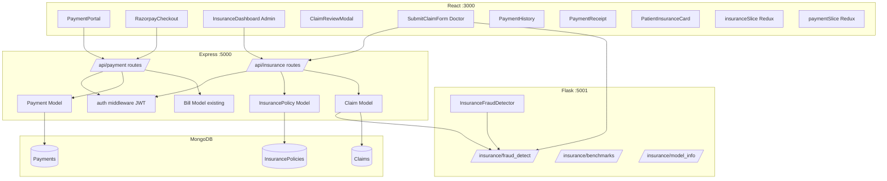
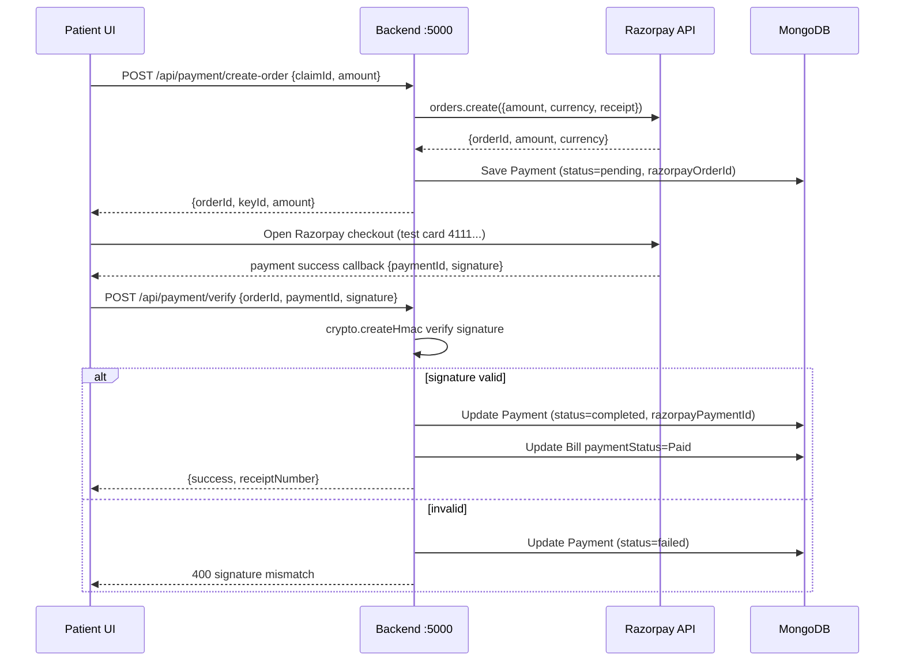

# Design Document: Payment (Razorpay Test Mode) + Insurance Fraud Detection

## Overview

This feature adds a complete Payment and Insurance Fraud Detection system to the existing Hospital Management System. It integrates Razorpay in test mode for patient payment processing, introduces insurance policy and claim management with a MongoDB-backed data layer, and extends the existing Python ML service with an XGBoost-based fraud detector that scores claims in real time. The system spans all three tiers: React frontend, Node.js/Express backend, and Python Flask ML service.

The design follows the existing patterns of the codebase: JWT-based role guards on every protected route, Mongoose models with auto-generated IDs (matching the `BILL000001` pattern in `Bill.js`), Redux slices for frontend state, and a Flask service that mirrors the `StaffAssignmentModel` class structure already in `ml-service/`.

## Architecture



## Sequence Diagrams

### Claim Submission with Fraud Pre-check (Doctor)

```mermaid
sequenceDiagram
    participant D as Doctor UI
    participant B as Backend :5000
    participant ML as Flask :5001
    participant DB as MongoDB

    D->>B: POST /api/insurance/claim/submit (JWT doctor)
    B->>DB: Lookup InsurancePolicy for patient
    DB-->>B: policy doc
    B->>ML: POST /insurance/fraud_detect {features}
    ML-->>B: {fraudScore, fraudReasons}
    B->>DB: Save Claim (status=pending or flagged if score>0.75)
    DB-->>B: saved claim
    B-->>D: {claim, fraudScore, fraudReasons}
    D->>D: Show fraud score badge; disable submit if flagged
```

### Razorpay Payment Flow



### Admin Claim Review

```mermaid
sequenceDiagram
    participant A as Admin UI
    participant B as Backend :5000
    participant DB as MongoDB

    A->>B: GET /api/insurance/claims (JWT admin)
    B->>DB: Find all claims, populate patient/doctor/policy
    DB-->>B: claims[]
    B-->>A: claims with fraudScore, fraudReasons
    A->>A: Render InsuranceDashboard table
    A->>B: PATCH /api/insurance/claims/:id/review {status, approvedAmount}
    B->>DB: Update Claim (status, approvedAmount, reviewedBy, reviewedAt)
    B->>DB: Update InsurancePolicy usedAmount += approvedAmount
    B-->>A: updated claim
    A->>A: Refresh table; PaymentPortal shows insurance deduction
```

## Components and Interfaces

### Backend: InsurancePolicy Model

**Purpose**: Stores patient insurance policy details including coverage limits and used amounts.

**Interface**:
```javascript
// backend/models/InsurancePolicy.js
{
  policyId: String,          // auto: POL000001
  patientId: ObjectId,       // ref: Patient
  providerName: String,
  policyNumber: String,
  coverageType: String,      // 'basic' | 'comprehensive' | 'premium'
  coverageAmount: Number,    // total coverage in INR
  usedAmount: Number,        // default 0
  startDate: Date,
  expiryDate: Date,
  status: String,            // 'active' | 'expired' | 'suspended'
  coveredDiagnoses: [String] // ICD codes or diagnosis names
}
```

### Backend: Claim Model

**Purpose**: Tracks insurance claims from submission through fraud scoring to admin review.

**Interface**:
```javascript
// backend/models/Claim.js
{
  claimId: String,           // auto: CLM000001
  patientId: ObjectId,       // ref: Patient
  policyId: ObjectId,        // ref: InsurancePolicy
  doctorId: ObjectId,        // ref: Doctor
  diagnosisCode: String,
  diagnosisName: String,
  treatmentCode: String,
  claimAmount: Number,
  approvedAmount: Number,    // set on review
  claimDate: Date,
  status: String,            // 'pending'|'approved'|'rejected'|'flagged'
  fraudScore: Number,        // 0.0 – 1.0 from ML
  fraudReasons: [String],    // e.g. ['high_amount','frequent_claims']
  reviewedBy: ObjectId,      // ref: User (admin)
  reviewedAt: Date
}
```

### Backend: Payment Model

**Purpose**: Records payment transactions linked to claims and Razorpay order lifecycle.

**Interface**:
```javascript
// backend/models/Payment.js
{
  paymentId: String,         // auto: PAY000001
  patientId: ObjectId,       // ref: Patient
  claimId: ObjectId,         // ref: Claim (optional)
  billAmount: Number,
  insuranceCovered: Number,  // from approvedAmount on claim
  patientLiability: Number,  // billAmount - insuranceCovered
  amountPaid: Number,
  razorpayOrderId: String,
  razorpayPaymentId: String,
  razorpaySignature: String,
  paymentMethod: String,     // 'razorpay'|'cash'|'insurance'
  status: String,            // 'pending'|'completed'|'failed'|'refunded'
  receiptNumber: String      // auto: RCP000001
}
```

### Backend: Insurance Routes

**Responsibilities**:
- Validate policy coverage before claim submission
- Submit claim → call ML fraud detection → persist with score
- Admin list/review claims with role guard
- Seed demo data

### Backend: Payment Routes

**Responsibilities**:
- Create Razorpay order and persist pending payment
- Verify HMAC-SHA256 signature and finalize payment
- Return payment history and printable receipt data

### ML Service: InsuranceFraudDetector

**Purpose**: XGBoost classifier trained on 2000 synthetic records, returns fraud probability and human-readable reasons.

**Interface**:
```python
class InsuranceFraudDetector:
    def predict(self, features: dict) -> dict:
        # returns: {fraudScore: float, fraudReasons: list[str], isFraud: bool}

    def get_benchmarks(self) -> dict:
        # returns: {diagnosisCode: avgAmount, ...}

    def get_model_info(self) -> dict:
        # returns: {accuracy, features, trainedOn, fraudRate}
```

### Frontend: InsuranceDashboard (Admin)

**Purpose**: Tabular view of all claims with fraud score indicators and inline review modal.

**Responsibilities**:
- Fetch claims via `GET /api/insurance/claims`
- Color-code rows by fraud score (green < 0.5, amber 0.5–0.75, red > 0.75)
- Open `ClaimReviewModal` for approve/reject; disable approve when `fraudScore > 0.75`

### Frontend: PaymentPortal

**Purpose**: Shows bill breakdown with insurance deduction and triggers Razorpay checkout.

**Responsibilities**:
- Display `billAmount`, `insuranceCovered`, `patientLiability`
- Call `POST /api/payment/create-order` then mount `RazorpayCheckout`
- On success callback, call `POST /api/payment/verify`

### Frontend: SubmitClaimForm (Doctor)

**Purpose**: Doctor-facing form with real-time fraud pre-check before final submission.

**Responsibilities**:
- On blur of `claimAmount`/`diagnosisCode`, call `POST /insurance/fraud_detect` directly against ML service
- Show live fraud score badge
- Block submission if pre-check score > 0.75

## Data Models

### InsurancePolicy

```javascript
{
  policyId: "POL000001",
  patientId: ObjectId,
  providerName: "Star Health",
  policyNumber: "SH-2024-001",
  coverageType: "comprehensive",
  coverageAmount: 500000,
  usedAmount: 45000,
  startDate: ISODate,
  expiryDate: ISODate,
  status: "active",
  coveredDiagnoses: ["J18.9", "I10", "E11"]
}
```

**Validation Rules**:
- `coverageAmount` > 0
- `expiryDate` > `startDate`
- `usedAmount` <= `coverageAmount`
- `status` in enum

### Claim

```javascript
{
  claimId: "CLM000001",
  patientId: ObjectId,
  policyId: ObjectId,
  doctorId: ObjectId,
  diagnosisCode: "J18.9",
  diagnosisName: "Pneumonia",
  treatmentCode: "T001",
  claimAmount: 85000,
  approvedAmount: 0,
  claimDate: ISODate,
  status: "flagged",
  fraudScore: 0.82,
  fraudReasons: ["high_amount", "frequent_claims"],
  reviewedBy: null,
  reviewedAt: null
}
```

**Validation Rules**:
- `claimAmount` > 0
- `fraudScore` in [0, 1]
- `status` in enum
- `approvedAmount` <= `claimAmount`

### Payment

```javascript
{
  paymentId: "PAY000001",
  patientId: ObjectId,
  claimId: ObjectId,
  billAmount: 85000,
  insuranceCovered: 60000,
  patientLiability: 25000,
  amountPaid: 25000,
  razorpayOrderId: "order_xxx",
  razorpayPaymentId: "pay_xxx",
  razorpaySignature: "sha256_hash",
  paymentMethod: "razorpay",
  status: "completed",
  receiptNumber: "RCP000001"
}
```

## Algorithmic Pseudocode

### Fraud Detection Algorithm (ML Service)

```pascal
ALGORITHM detectFraud(features)
INPUT: features = {
  claimAmount, diagnosisCode, daysSinceLastClaim,
  claimsLast90Days, amountVsBenchmark, isDuplicate,
  policyAgeDays, providerClaimRate, patientAge
}
OUTPUT: {fraudScore, fraudReasons, isFraud}

BEGIN
  ASSERT features.claimAmount > 0
  ASSERT features.policyAgeDays >= 0

  // Step 1: Prepare feature vector
  X ← encodeFeatures(features)

  // Step 2: XGBoost predict_proba
  fraudScore ← xgb_model.predict_proba([X])[0][1]

  // Step 3: Build human-readable reasons
  fraudReasons ← []

  IF features.amountVsBenchmark > 2.0 THEN
    fraudReasons.append("high_amount")
  END IF

  IF features.claimsLast90Days > 3 THEN
    fraudReasons.append("frequent_claims")
  END IF

  IF features.isDuplicate = true THEN
    fraudReasons.append("duplicate_claim")
  END IF

  IF features.policyAgeDays < 30 THEN
    fraudReasons.append("new_policy")
  END IF

  IF features.providerClaimRate > 0.8 THEN
    fraudReasons.append("high_provider_frequency")
  END IF

  isFraud ← fraudScore > 0.75

  ASSERT 0.0 <= fraudScore <= 1.0

  RETURN {fraudScore, fraudReasons, isFraud}
END
```

**Preconditions**:
- `features.claimAmount` is a positive number
- XGBoost model is loaded and fitted
- `features.policyAgeDays` >= 0

**Postconditions**:
- `fraudScore` ∈ [0.0, 1.0]
- `fraudReasons` is a list (may be empty)
- `isFraud` is true iff `fraudScore > 0.75`

**Loop Invariants**: N/A (no loops; vectorized XGBoost inference)

---

### Razorpay Signature Verification Algorithm (Backend)

```pascal
ALGORITHM verifyPayment(orderId, paymentId, signature, secret)
INPUT: orderId, paymentId, signature (from Razorpay callback), secret (RAZORPAY_KEY_SECRET)
OUTPUT: isValid (boolean)

BEGIN
  ASSERT orderId IS NOT NULL
  ASSERT paymentId IS NOT NULL
  ASSERT signature IS NOT NULL

  // Razorpay spec: HMAC-SHA256 of "orderId|paymentId"
  body ← orderId + "|" + paymentId
  expectedSignature ← HMAC_SHA256(body, secret)

  isValid ← timingSafeEqual(expectedSignature, signature)

  RETURN isValid
END
```

**Preconditions**:
- All three Razorpay fields are non-null strings
- `RAZORPAY_KEY_SECRET` is set in environment

**Postconditions**:
- Returns boolean; no side effects
- Uses timing-safe comparison to prevent timing attacks

---

### Claim Submission with Auto-Flag Algorithm (Backend)

```pascal
ALGORITHM submitClaim(claimData, doctorId)
INPUT: claimData = {patientId, policyId, diagnosisCode, claimAmount, ...}
OUTPUT: {claim, fraudScore, fraudReasons}

BEGIN
  // Step 1: Validate policy
  policy ← InsurancePolicy.findOne({_id: claimData.policyId, status: 'active'})

  IF policy IS NULL THEN
    RETURN Error("Policy not found or inactive")
  END IF

  IF policy.expiryDate < NOW() THEN
    RETURN Error("Policy expired")
  END IF

  IF (policy.usedAmount + claimData.claimAmount) > policy.coverageAmount THEN
    RETURN Error("Claim exceeds remaining coverage")
  END IF

  // Step 2: Build ML features
  daysSinceLastClaim ← computeDaysSinceLastClaim(claimData.patientId)
  claimsLast90Days ← countClaimsLast90Days(claimData.patientId)
  benchmark ← getBenchmarkAmount(claimData.diagnosisCode)
  amountVsBenchmark ← claimData.claimAmount / benchmark
  isDuplicate ← checkDuplicate(claimData.patientId, claimData.diagnosisCode, 30)
  policyAgeDays ← daysBetween(policy.startDate, NOW())

  features ← {
    claimAmount: claimData.claimAmount,
    diagnosisCode: claimData.diagnosisCode,
    daysSinceLastClaim, claimsLast90Days,
    amountVsBenchmark, isDuplicate,
    policyAgeDays,
    providerClaimRate: 0.0,
    patientAge: computeAge(patient.dateOfBirth)
  }

  // Step 3: Call ML service
  mlResult ← HTTP_POST("http://localhost:5001/insurance/fraud_detect", features)
  fraudScore ← mlResult.fraudScore
  fraudReasons ← mlResult.fraudReasons

  // Step 4: Determine status
  status ← IF fraudScore > 0.75 THEN 'flagged' ELSE 'pending'

  // Step 5: Persist
  claim ← Claim.create({
    ...claimData,
    doctorId,
    fraudScore,
    fraudReasons,
    status,
    claimDate: NOW()
  })

  ASSERT claim.fraudScore = fraudScore
  ASSERT claim.status IN ['pending', 'flagged']

  RETURN {claim, fraudScore, fraudReasons}
END
```

**Preconditions**:
- Doctor JWT is valid and role = 'doctor'
- `claimData.policyId` references an existing InsurancePolicy
- ML service is reachable at port 5001

**Postconditions**:
- Claim is persisted with `fraudScore` and `fraudReasons`
- `status = 'flagged'` iff `fraudScore > 0.75`
- Policy `usedAmount` is NOT updated yet (only on admin approval)

**Loop Invariants**: N/A

## Key Functions with Formal Specifications

### `createRazorpayOrder(req, res)`

```javascript
// POST /api/payment/create-order
async function createRazorpayOrder(req, res)
```

**Preconditions**:
- `req.user` is authenticated (JWT middleware passed)
- `req.body.amount` is a positive integer (paise)
- `RAZORPAY_KEY_ID` and `RAZORPAY_KEY_SECRET` are set

**Postconditions**:
- Razorpay order created with `receipt = paymentId`
- Payment document saved with `status = 'pending'`
- Returns `{ orderId, keyId, amount, currency }`

**Error Cases**:
- Razorpay API failure → 500 with message
- Missing amount → 400 validation error

---

### `verifyRazorpayPayment(req, res)`

```javascript
// POST /api/payment/verify
async function verifyRazorpayPayment(req, res)
```

**Preconditions**:
- `req.body` contains `{ razorpayOrderId, razorpayPaymentId, razorpaySignature }`
- Matching Payment document exists with `status = 'pending'`

**Postconditions**:
- If signature valid: Payment `status = 'completed'`, `razorpayPaymentId` stored, `receiptNumber` generated
- If signature invalid: Payment `status = 'failed'`, returns 400
- Linked Bill `paymentStatus` updated to `'Paid'` on success

---

### `reviewClaim(req, res)`

```javascript
// PATCH /api/insurance/claims/:claimId/review
async function reviewClaim(req, res)
```

**Preconditions**:
- `req.user.role = 'admin'`
- `req.body.status` ∈ `['approved', 'rejected']`
- Claim exists and is in `'pending'` or `'flagged'` state
- If approving: `req.body.approvedAmount` > 0

**Postconditions**:
- Claim `status`, `approvedAmount`, `reviewedBy`, `reviewedAt` updated
- If approved: `InsurancePolicy.usedAmount += approvedAmount`
- Returns updated claim document

---

### `InsuranceFraudDetector.predict(features)`

```python
def predict(self, features: dict) -> dict
```

**Preconditions**:
- `self.model` is a fitted XGBClassifier
- `features` contains all 9 required keys
- `features['claimAmount']` > 0

**Postconditions**:
- Returns dict with `fraudScore ∈ [0.0, 1.0]`
- `fraudReasons` is a list of strings (may be empty)
- `isFraud = fraudScore > 0.75`
- No mutation of input `features`

## Example Usage

```javascript
// 1. Doctor submits a claim (frontend)
const response = await api.post('/api/insurance/claim/submit', {
  patientId: 'patient_id',
  policyId: 'policy_id',
  diagnosisCode: 'J18.9',
  diagnosisName: 'Pneumonia',
  treatmentCode: 'T001',
  claimAmount: 85000
}, { headers: { Authorization: `Bearer ${doctorToken}` } })
// response: { claim: {...}, fraudScore: 0.82, fraudReasons: ['high_amount'] }

// 2. Create Razorpay order (frontend PaymentPortal)
const order = await api.post('/api/payment/create-order', {
  claimId: 'claim_id',
  amount: 2500000  // patientLiability in paise
})
// order: { orderId: 'order_xxx', keyId: 'rzp_test_xxx', amount: 2500000 }

// 3. Verify payment after Razorpay callback
const result = await api.post('/api/payment/verify', {
  razorpayOrderId: 'order_xxx',
  razorpayPaymentId: 'pay_xxx',
  razorpaySignature: 'sha256_hash'
})
// result: { success: true, receiptNumber: 'RCP000001' }

// 4. Admin reviews claim
await api.patch(`/api/insurance/claims/${claimId}/review`, {
  status: 'approved',
  approvedAmount: 60000
}, { headers: { Authorization: `Bearer ${adminToken}` } })
```

```python
# 5. ML fraud detection (Flask endpoint)
detector = InsuranceFraudDetector()
result = detector.predict({
    'claimAmount': 85000,
    'diagnosisCode': 'J18.9',
    'daysSinceLastClaim': 5,
    'claimsLast90Days': 4,
    'amountVsBenchmark': 2.3,
    'isDuplicate': False,
    'policyAgeDays': 20,
    'providerClaimRate': 0.85,
    'patientAge': 45
})
# result: { 'fraudScore': 0.82, 'fraudReasons': ['high_amount', 'frequent_claims', 'new_policy'], 'isFraud': True }
```

## Correctness Properties

*A property is a characteristic or behavior that should hold true across all valid executions of a system — essentially, a formal statement about what the system should do. Properties serve as the bridge between human-readable specifications and machine-verifiable correctness guarantees.*

### Property 1: Fraud Score Bounds

*For any* valid feature dict passed to the FraudDetector, the returned `fraudScore` must always be in the range [0.0, 1.0].

**Validates: Requirements 6.2**

---

### Property 2: Auto-Flag Consistency

*For any* claim persisted by the InsuranceService, `claim.status = 'flagged'` if and only if `claim.fraudScore > 0.75`, and `claim.status = 'pending'` if and only if `claim.fraudScore <= 0.75`.

**Validates: Requirements 5.6, 5.7, 6.3**

---

### Property 3: Coverage Invariant

*For any* sequence of claim approvals, `policy.usedAmount` must never exceed `policy.coverageAmount` after any approval operation.

**Validates: Requirements 4.2, 7.4**

---

### Property 4: Payment Idempotency

*For any* `razorpayOrderId` whose Payment document already has `status = 'completed'`, calling `POST /api/payment/verify` again must return HTTP 409 and must not create a duplicate Payment record or modify the existing one.

**Validates: Requirements 2.5**

---

### Property 5: Signature Rejection

*For any* verify request where the provided `razorpaySignature` does not match the HMAC-SHA256 of `"razorpayOrderId|razorpayPaymentId"`, the PaymentService must return HTTP 400 and set the Payment document's `status` to `'failed'`.

**Validates: Requirements 2.4**

---

### Property 6: Role Enforcement

*For any* request to a role-guarded endpoint (`POST /api/insurance/claim/submit`, `GET /api/insurance/claims`, `PATCH /api/insurance/claims/:id/review`) made with a JWT whose role does not match the required role, the AuthMiddleware must return HTTP 403 and must not execute the handler.

**Validates: Requirements 7.2, 7.6, 10.1, 10.2, 10.3, 10.4**

---

### Property 7: Receipt Uniqueness

*For any* set of completed Payment documents, all `receiptNumber` values must be distinct — no two completed payments may share the same receipt number.

**Validates: Requirements 3.3**

---

### Property 8: Liability Calculation

*For any* Payment document, `patientLiability` must equal `billAmount - insuranceCovered`.

**Validates: Requirements 3.4**

---

### Property 9: Fraud Reasons Completeness

*For any* feature dict passed to the FraudDetector, each fraud reason flag must appear in `fraudReasons` if and only if its corresponding threshold condition is met: `"high_amount"` when `amountVsBenchmark > 2.0`, `"frequent_claims"` when `claimsLast90Days > 3`, `"duplicate_claim"` when `isDuplicate = true`, `"new_policy"` when `policyAgeDays < 30`, and `"high_provider_frequency"` when `providerClaimRate > 0.8`.

**Validates: Requirements 6.4, 6.5, 6.6, 6.7, 6.8**

---

### Property 10: Secret Key Non-Exposure

*For any* API response from the Backend, the response body must not contain the value of `RAZORPAY_KEY_SECRET`.

**Validates: Requirements 1.5, 10.5**

---

### Property 11: Claim Submission Does Not Modify Coverage

*For any* claim submission that passes policy validation, `policy.usedAmount` must remain unchanged immediately after the submission — it must only change on admin approval.

**Validates: Requirements 5.11**

---

### Property 12: Invalid Amount Rejection

*For any* create-order request where `amount` is zero, negative, non-integer, or missing, the PaymentService must return HTTP 400 and must not persist a Payment document.

**Validates: Requirements 1.3**

---

### Property 13: Coverage Exceeded Rejection

*For any* claim submission where `claimAmount + policy.usedAmount > policy.coverageAmount`, the InsuranceService must return HTTP 400 and must not persist a Claim document.

**Validates: Requirements 5.4**

## Error Handling

### Error Scenario 1: ML Service Unavailable

**Condition**: Flask service at port 5001 is down when claim is submitted
**Response**: Backend catches axios timeout/connection error; claim is saved with `fraudScore = -1` and `status = 'pending'` (not auto-flagged)
**Recovery**: Admin can manually review; ML service reconnects on next request

### Error Scenario 2: Razorpay Signature Mismatch

**Condition**: `razorpaySignature` in verify request does not match HMAC-SHA256
**Response**: 400 `{ message: 'Payment verification failed' }`; Payment record updated to `status = 'failed'`
**Recovery**: Patient can retry payment; a new order is created

### Error Scenario 3: Coverage Exceeded

**Condition**: `claimAmount + policy.usedAmount > policy.coverageAmount`
**Response**: 400 `{ message: 'Claim amount exceeds remaining coverage' }`
**Recovery**: Doctor adjusts claim amount or patient pays out-of-pocket

### Error Scenario 4: Expired Policy

**Condition**: `policy.expiryDate < Date.now()` at claim submission time
**Response**: 400 `{ message: 'Insurance policy has expired' }`
**Recovery**: Patient must renew policy or pay directly

### Error Scenario 5: Duplicate Payment Verification

**Condition**: `POST /api/payment/verify` called with an already-completed `razorpayOrderId`
**Response**: 409 `{ message: 'Payment already processed' }`
**Recovery**: Frontend redirects to receipt page

## Testing Strategy

### Unit Testing Approach

- Backend route handlers tested with Jest + Supertest (existing pattern in `backend/`)
- Mock Razorpay SDK to avoid real API calls
- Mock axios calls to ML service
- Test fraud score threshold boundary: score = 0.75 (not flagged), score = 0.751 (flagged)
- Test HMAC signature verification with known test vectors

### Property-Based Testing Approach

**Property Test Library**: fast-check (JavaScript), hypothesis (Python)

Key properties to test:
- `fraudScore` always in [0, 1] for any numeric feature input
- `patientLiability = billAmount - insuranceCovered` for all payment records
- Signature verification is deterministic: same inputs always produce same boolean result
- `usedAmount` never exceeds `coverageAmount` after any sequence of approvals

### Integration Testing Approach

- End-to-end: Submit claim → ML scores → Admin approves → Payment created → Razorpay verify → Receipt generated
- Use Razorpay test card `4111 1111 1111 1111` in test mode
- Seed test data via `POST /api/insurance/seed` before integration tests

## Performance Considerations

- XGBoost inference is synchronous but fast (<50ms for single prediction); no async needed in Flask
- Razorpay order creation is async; backend uses `await razorpay.orders.create()`
- Claims list endpoint should paginate (default page size 20) to avoid large payloads for admin dashboard
- ML model loaded once at Flask startup (singleton pattern matching `get_staff_assigner()`)

## Security Considerations

- `RAZORPAY_KEY_SECRET` stored only in `backend/.env`, never sent to frontend
- Frontend only receives `RAZORPAY_KEY_ID` (public key)
- Signature verification uses `crypto.timingSafeEqual` to prevent timing attacks
- All insurance and payment routes require valid JWT; role checks enforce doctor/admin separation
- Fraud score is computed server-side; frontend pre-check is UX-only and not trusted for auto-flagging

## Dependencies

**Backend (new)**:
- `razorpay` — official Node.js SDK
- `crypto` — built-in Node.js module (HMAC verification)

**Frontend (new)**:
- Razorpay checkout script loaded via CDN `<script src="https://checkout.razorpay.com/v1/checkout.js">`
- No npm package needed for Razorpay on frontend

**ML Service (new)**:
- `xgboost` — XGBoost classifier
- `scikit-learn` — preprocessing, train/test split
- `faker` — synthetic training data generation
- `joblib` — model serialization (replaces pickle for sklearn objects)
